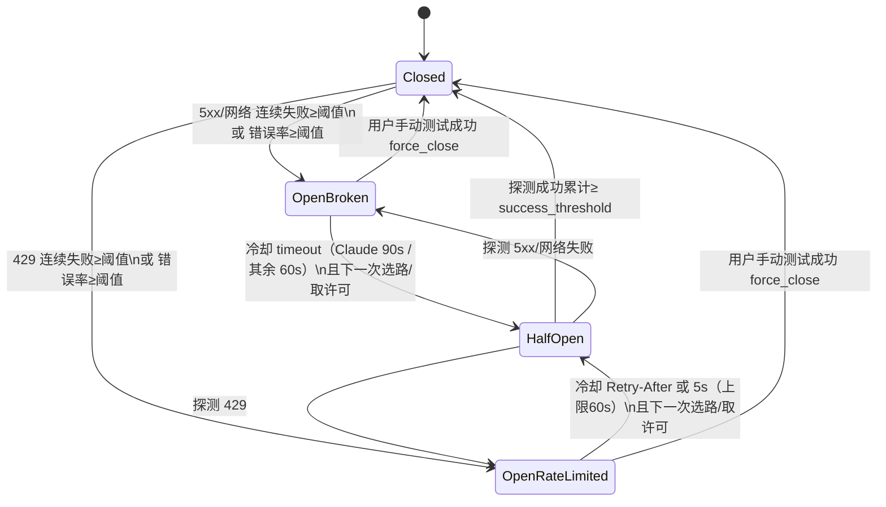
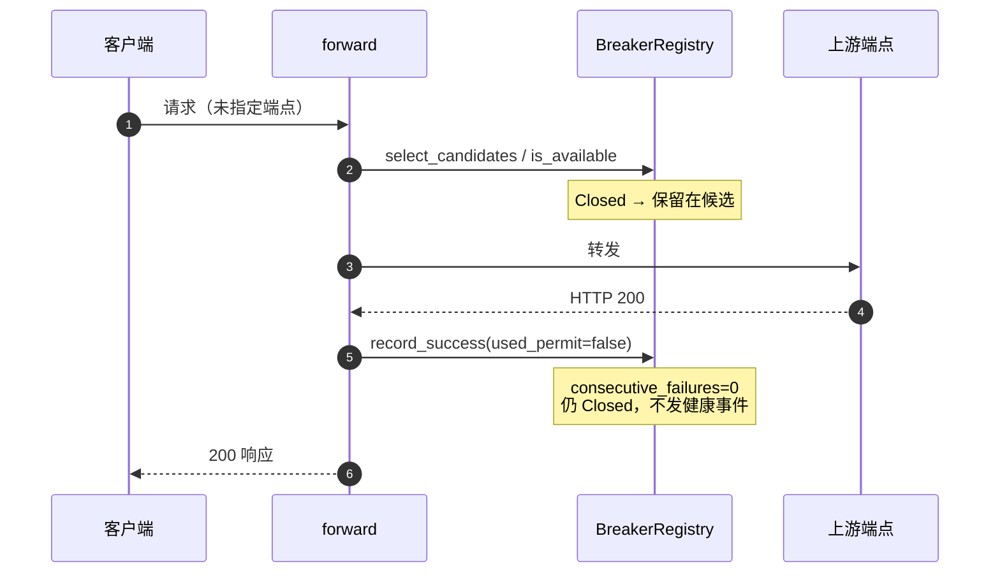
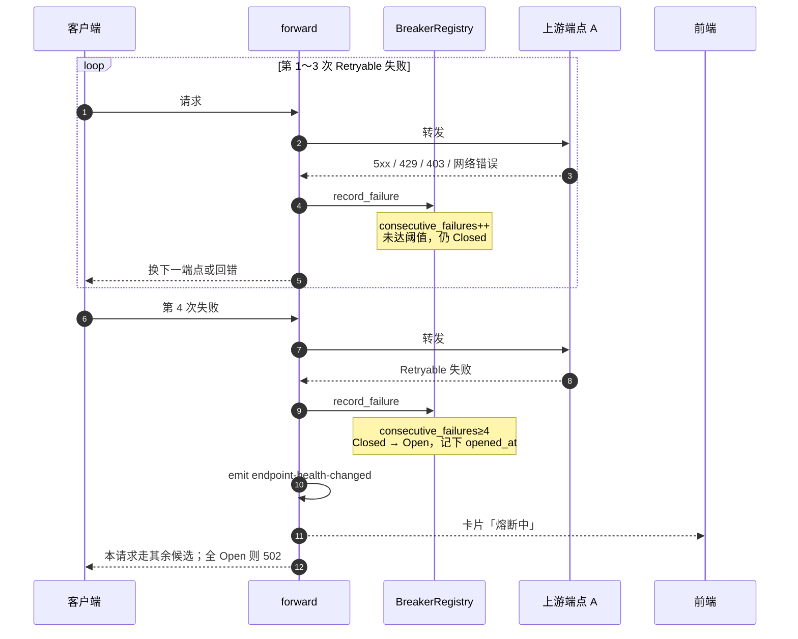
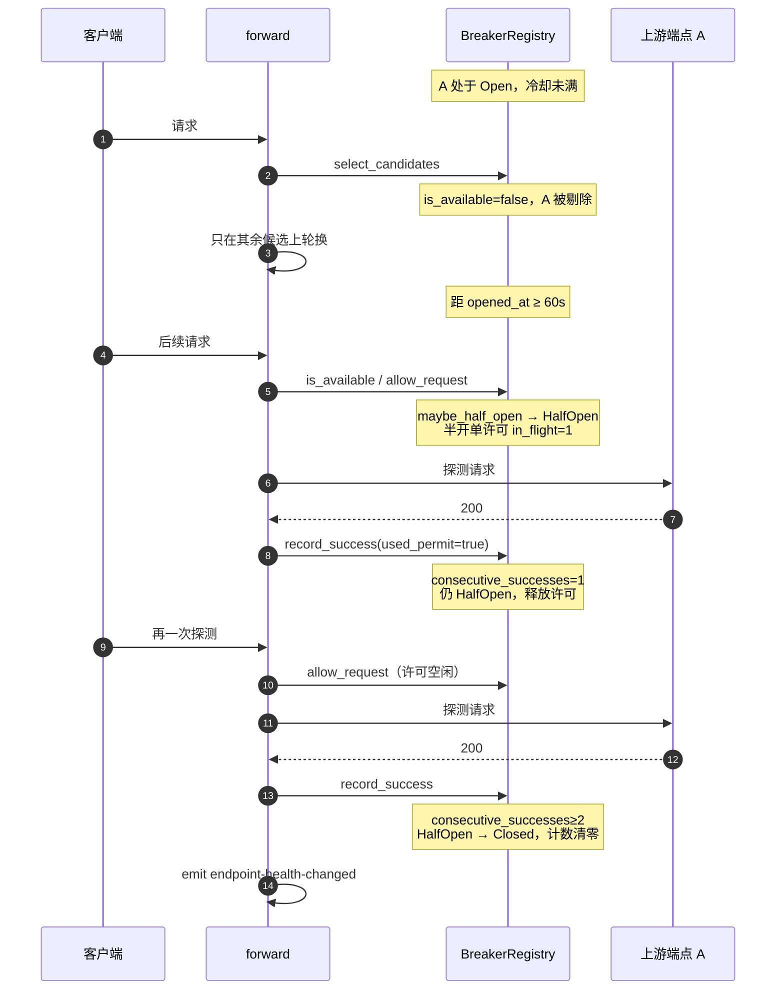
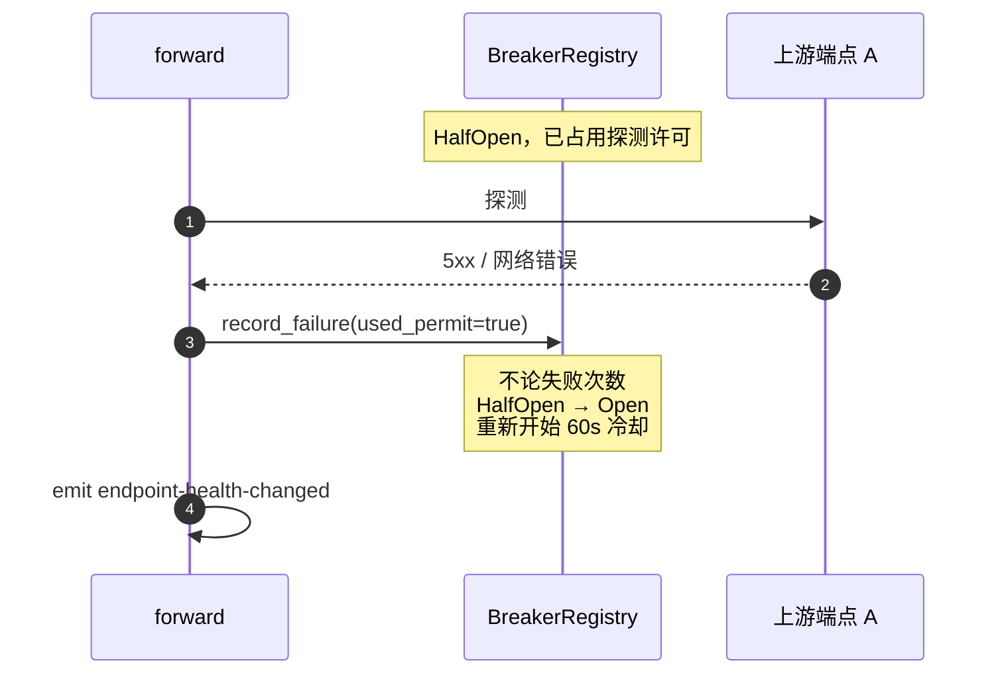
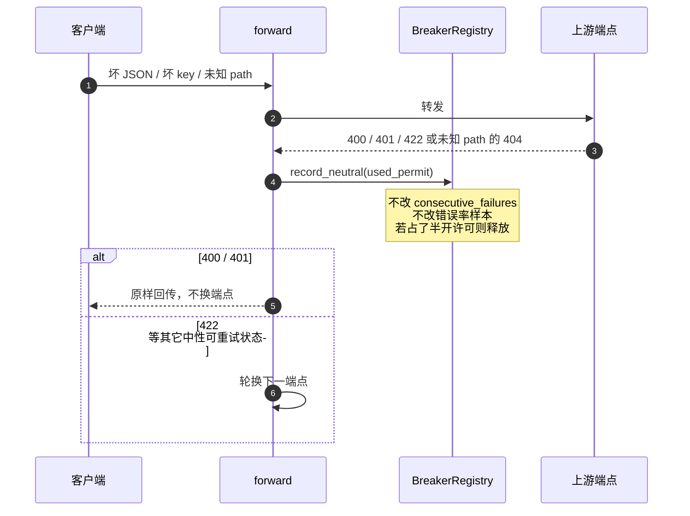
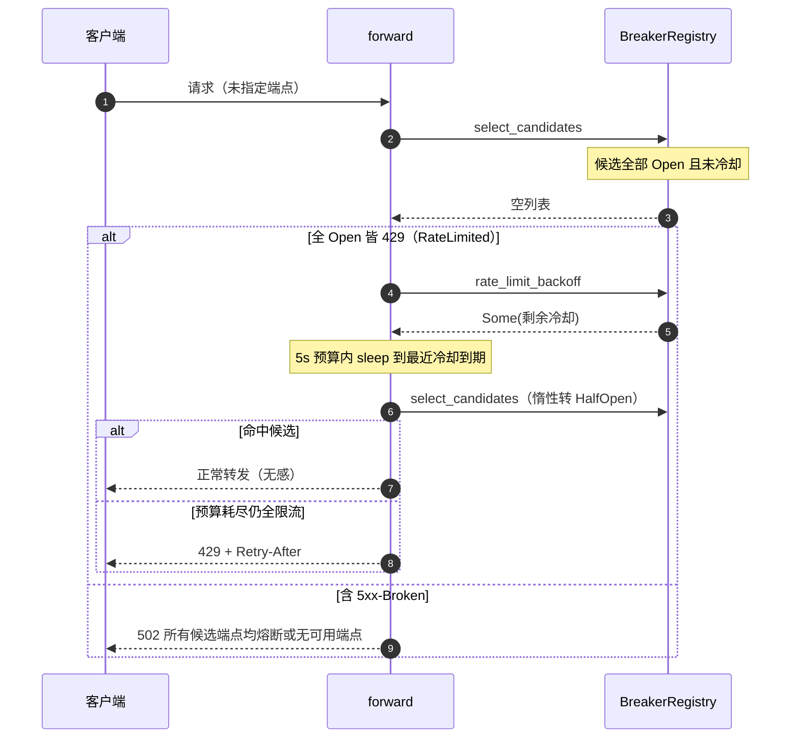
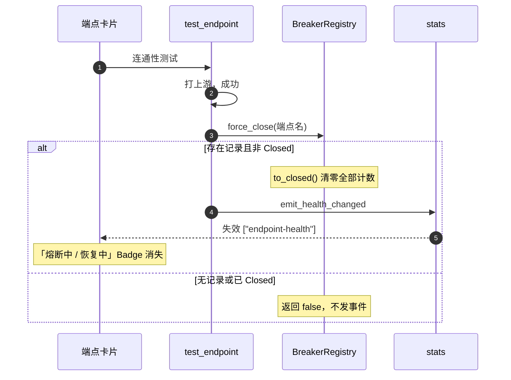

# 端点熔断器：触发、恢复与选路

> 一句话结论：每端点独立三态熔断，请求驱动、无后台轮询；连续失败或错误率超阈值进入 Open，冷却后惰性探测恢复。

数字真源见站点文档 [轮换与熔断](../../../docs-site/advanced/rotation.md) 与 `CircuitBreakerConfig::default()`。状态码分类原则见 [circuit-breaker-status-classification.md](../decisions/circuit-breaker-status-classification.md)。

---

## 设计定位

多上游网关里，单个端点持续 5xx / 429 / 网络故障时，继续把流量打过去只会拖垮整条请求。熔断器按**端点名**隔离故障：Open 端点被选路跳过，其余端点继续轮换。

核心约束：

- **请求驱动**：没有后台健康探测线程。Open → HalfOpen 发生在下一次真实请求经过 `is_available` / `allow_request` 时（惰性）。
- **运行期内存**：`BreakerRegistry` 挂在 `ProxyState` 上，代理启动时新建。停代理或重启进程即清空。
- **每端点独立**：A 熔断不影响 B；轮换与熔断都先按模型过滤，避免无关端点被误伤。
- **配置本期固定**：`CircuitBreakerConfig` 结构预留热更新，当前用默认常量。

实现入口：

| 层 | 文件 | 职责 |
|----|------|------|
| 状态机 | `src-tauri/src/modules/proxy/circuit_breaker.rs` | 三态、许可、计数、选路过滤 |
| 结果分类 | `src-tauri/src/modules/proxy/rotation.rs` | HTTP / 网络错误 → Retryable / NonRetryable |
| 接入 | `src-tauri/src/modules/proxy/forward.rs` | 选路、gate、上报、发健康事件 |
| 手动恢复 | `src-tauri/src/commands/endpoint.rs` | 连通性测试成功 → `force_close` |
| 对外 | `src-tauri/src/commands/health.rs` + 前端 `useEndpointHealth` | 卡片 Badge / 仪表盘状态点 |

---

## 三态与内部计数

```text
        5xx/网络 连续失败≥阈值 或 错误率≥阈值       429 连续失败≥阈值 或 错误率≥阈值
 Closed --------------------------------------> Open(Broken)   Open(RateLimited)
   ^                                              | timeout（Claude 90s / 其余 60s）  | Retry-After 或 5s（上限 60s）
   | 半开探测成功累计 ≥ success_threshold           v                                 v
   +------------------------------------------ HalfOpen <---------------------------+
                                   |
                                   +-- 探测失败 → 立即重新 Open（按失败原因记新冷却）
```

| 状态 | 选路 | 发请求 | 对外 status / circuit |
|------|------|--------|------------------------|
| **Closed** | 可选 | 放行 | `healthy` / `closed` |
| **Open**（Broken / RateLimited） | 跳过（未到期） | 拒绝 | `unhealthy` / `open` |
| **HalfOpen** | 可选 | 同一时刻只放行 1 个探测 | `recovering` / `halfOpen` |

每个端点一份 `BreakerInner`：

| 字段 | 作用 |
|------|------|
| `consecutive_failures` | 连续失败次数；达 `failure_threshold` → Open |
| `consecutive_successes` | **仅 HalfOpen** 累计探测成功；达 `success_threshold` → Closed |
| `total_requests` / `failed_requests` | 自上次闭合以来的样本，算错误率 |
| `half_open_in_flight` | 半开探测占用（上限 1） |
| `opened_at` | 进入 Open 的时刻，用来判断冷却 |
| `open_reason` | `Broken`（5xx/网络）或 `RateLimited`（429），决定冷却时长 |
| `retry_after` | 429 携带的 `Retry-After`（若上游提供），仅 RateLimited 时有效 |
| `last_error` / `last_failure_ms` | 给 UI 悬停提示 |

`to_closed()` 会清零全部计数与 `opened_at`/`open_reason`/`retry_after`。`to_open()` 清半开许可和连续成功，记下 `opened_at` 与 reason。`to_half_open()` 清许可和连续成功，**不**清失败计数（失败计数在下次 `record_*` 时再变）。

---

## 默认参数

阈值按入站协议区分（对齐 cc-switch per-app）：Claude 入站（Claude Code）放宽，其余维持。

| 参数 | Claude 入站 | OpenAI/Responses 入站 | 含义 |
|------|------------|----------------------|------|
| `failure_threshold` | **8** | **4** | 连续失败达此次数 → Open |
| `success_threshold` | **3** | **2** | HalfOpen 连续成功达此次数 → Closed |
| `timeout`（Broken 冷却） | **90s** | **60s** | Open(Broken) → HalfOpen 冷却时长 |
| `error_rate_threshold` | **0.7** | **0.6** | 错误率阈值（失败 / 总请求） |
| `min_requests` | **15** | **10** | 计算错误率的最小样本数 |
| `rate_limit_timeout` | **5s** | **5s** | Open(RateLimited) 缺省冷却（无 Retry-After 时） |
| `max_rate_limit_timeout` | **60s** | **60s** | Retry-After 安全上限 |

触发 Open 满足**任一**即可（只在 Closed 态判定，阈值随当次请求入站协议而定）：

1. `consecutive_failures >= failure_threshold`
2. `total_requests >= min_requests` 且 `failed_requests / total_requests >= error_rate_threshold`

HalfOpen 下**任意一次** Retryable 失败立刻回 Open，不看阈值（按失败原因记新冷却）。

Closed 下一次成功会把 `consecutive_failures` 清零，但不增加 `consecutive_successes`（那个计数只服务半开恢复）。

---

## 429 限流降噪

429（瞬时限流）与 5xx/网络（端点坏了）分开处理，避免限流突发把端点打进 60-90s 长冷却：

- **429 → Open(RateLimited)**：冷却 = 上游 `Retry-After`（缺省 `rate_limit_timeout`=5s，上限 `max_rate_limit_timeout`=60s，防上游恶意长值锁死端点）。HalfOpen 探测再 429 也按短冷却重开。
- **网关内退避**：候选端点全部因 429 被摘除时，`forward` 在 5s 预算内 sleep 到最近一个限流端点冷却到期（`BreakerRegistry::rate_limit_backoff` 返回最近剩余冷却），重新 `select_candidates`（惰性转 HalfOpen）后转发，客户端无感。
- **降级回 429**：退避预算耗尽仍全限流 → 回 `429 + Retry-After`（`rate_limited_response`），而非 502「无端点可用」，Claude Code 自然退避重试。被摘端点含 5xx-Broken → `rate_limit_backoff` 返回 None，仍回 502。

`Retry-After` 仅解析 delta-seconds；HTTP-date 暂不支持（上游少用，且解析需额外依赖）。

---

## 什么计入失败、什么中性

`forward` 对 200 直接 `record_success`；非 200 走 `rotation::categorize_status(status, inbound_path)`。网络错误一律 `record_failure`（Broken）。

### 计入熔断失败（Retryable）

- HTTP `403`（渠道权限 / 配额 / UA 限制，换端点才有意义）→ Broken
- HTTP `429` → **RateLimited**（短冷却，可带 Retry-After）
- 全部 `5xx` → Broken
- **已知业务 path** 上的 `404`：`/v1/messages`、`/v1/chat/completions`、`/v1/responses`、`/v1/models` → Broken
- 其它非客户端错误状态（如 `408`、`409`）→ Broken
- 上游网络错误（超时、EOF、连接重置等）→ Broken

### 中性（NonRetryable）——只释放半开许可，不改计数

- 客户端错误：`400` / `401` / `405` / `406` / `413` / `414` / `415` / `422`
- **未知入站 path** 的 `404`（扫描器 / 误配打到 `/api/hello` 等）
- 客户端中断（实现上同样走 `record_neutral`）

注意三套分类互相独立：

| 问题 | 函数 | 效果 |
|------|------|------|
| 要不要计熔断 | `categorize_status` | `record_failure` vs `record_neutral` |
| 计哪种 Open | `forward` 按 status 构造 `FailureKind` | `Broken`（长冷却）vs `RateLimited`（短冷却） |
| 要不要换下一个端点 | `should_retry_status` | 除 `200` / `400` / `401` 外都换 |
| 要不要原地再打一次 | `is_transient_network_error` | 同一端点 + 300ms |

因此 `422`：不计熔断，但仍会轮换到下一个端点。`400` / `401`：不计熔断，也不换端点，直接回客户端。日志 `is_error` 与熔断也独立：未知 path 的 404 仍记 error 红点。

---

## 选路与 gate

非显式端点时的过滤顺序：

```text
可路由端点（快速队列优先）
  → 按请求模型过滤（无端点声明该模型则回退全量）
  → select_candidates：丢掉未到期的 Open
  → 候选为空且全 Open 皆 429 → 5s 预算内退避重试 select_candidates
  → 退避后仍空且全限流 → 回 429 + Retry-After；含 Broken 或模型不匹配 → 502
  → 二次模型过滤（兜底残留时避免误伤不支持该模型的端点）
```

显式指定端点（请求头、`@端点名/模型名`、查询参数）**绕过**熔断选路，结果仍计入熔断。

`gate` 条件：`select_candidates` 之后候选数变少（说明剔除了至少一个 Open）。此时对每个候选取 `allow_request`：

- Closed：放行，不占半开许可
- HalfOpen：`half_open_in_flight < 1` 才放行，占用许可
- 拒绝：`rotation.advance`，试下一个候选

候选数没变（全 Closed，或全部已冷却成 HalfOpen）时 **不 gate**，也就不走半开单许可。全 Open 未到期时候选为空，直接 502，到不了 `allow_request`。

`allow_request` / `is_available` 都会先调 `maybe_half_open`：Open 且 `now - opened_at >= 60s` → 惰性转 HalfOpen。

---

## 状态机



阈值随当次请求入站协议而定（Claude 8/3/90s，其余 4/2/60s）。

---

## 时序图

### 1. 正常放行（Closed）



### 2. 连续失败触发熔断



错误率路径同一套 `record_failure`：样本 ≥ 10 且失败占比 ≥ 0.6 时，即使连续失败被成功打断，也会 trip。

### 3. 冷却后探测恢复



半开期间若另有并发请求：第二个 `allow_request` 直接拒绝，`forward` 换下一个端点，避免探测雪崩。

### 4. 半开探测失败：立即重新熔断



### 5. 中性结果不污染熔断



### 6. 全候选熔断 → 502 / 429



不再把完整列表当兜底放行——否则模型过滤后的集合会被级联扩大，打到不支持该模型的端点。

### 7. 用户手动测试强制闭合



代理未运行时没有 `BreakerRegistry`，卡片靠库内 `test_status` 粗映射（`available` → healthy，`unavailable` → unhealthy）。

---

## 对外健康态

`get_endpoint_health`：

| 条件 | 数据来源 |
|------|----------|
| 代理运行中，该端点有过流量 | `BreakerRegistry::health_of` |
| 代理运行中，零流量 | 回退 `test_status`（避免伪造 healthy 盖掉手动测试结论） |
| 代理未运行 | 全部按 `test_status` |

状态转换（`record_success` / `record_failure` / `force_close` 返回 `true`）才 `emit endpoint-health-changed`。前端 `useEndpointHealthEvents` 只失效 `["endpoint-health"]`，与端点配置变更的 `["endpoints"]` 分开。

卡片 / 仪表盘：`circuit === "open"` 显示「熔断中」，`halfOpen` 显示「恢复中」。

---

## 与轮换的边界

熔断决定**谁能进候选、半开能不能发**；轮换决定**候选里先打谁、失败几次换下一个**：

- 前进：`(当前 + 1) % 候选数`
- 同一端点连续失败 2 次后切换
- 最大尝试次数 = 熔断过滤后的候选数 × 2（显式端点固定 3 次）
- 瞬时网络错误：不换端点，睡 300ms 再打同一端点（这次失败仍计入熔断）

两套机制共用 `categorize_status` / `should_retry_status`，但触发阈值不同：轮换 2 次就换人，熔断要连续 4 次（或错误率）才 Open。

---

## 实现要点（改代码时）

- `record_*` 必须回传 `used_half_open_permit`，否则半开许可泄漏，探测通道堵死。
- `record_failure` 现需传 `inbound: InboundKind`（选阈值 preset）与 `kind: FailureKind`（选冷却）；429 用 `FailureKind::RateLimited { retry_after }`，其余用 `FailureKind::Broken`。
- `is_available` / `allow_request` / `record_success` / `select_candidates` / `rate_limit_backoff` 均需 `inbound` 参数。
- 404 用**入站 path** 判定是否已知业务，不要用转换后的出站 path。
- 新增业务 path 要同时改 `rotation::is_known_business_path`（漏加会把该 path 的 404 误标中性）。
- 改阈值只动 `CircuitBreakerConfig::default` / `CircuitBreakerConfig::claude`，并同步 `docs-site/advanced/rotation.md`。
- `Retry-After` 仅解析 delta-seconds（`parse_retry_after`）；HTTP-date 暂不支持。
- 单测在 `circuit_breaker.rs`（连续失败 / 错误率 / 半开恢复 / 半开再熔断 / 中性 / 全 Open 空候选 / force_close / 429 短冷却 / Retry-After / Claude 阈值 / rate_limit_backoff）、`forward.rs`（parse_retry_after / rate_limited_response）和 `rotation.rs`（状态码分类）。
