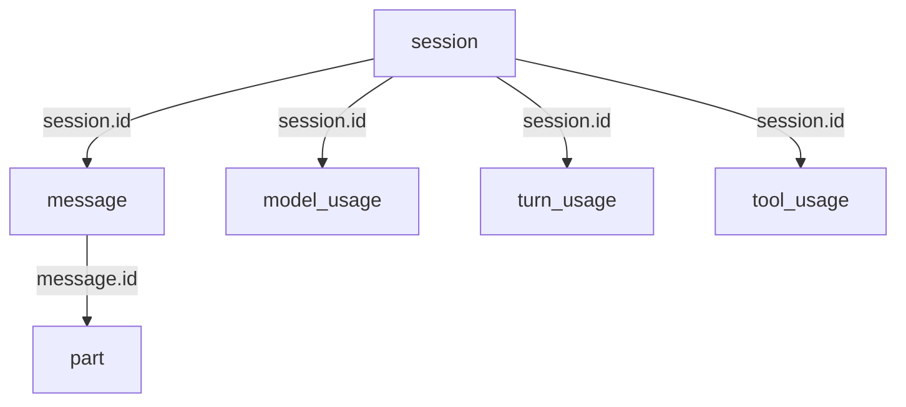
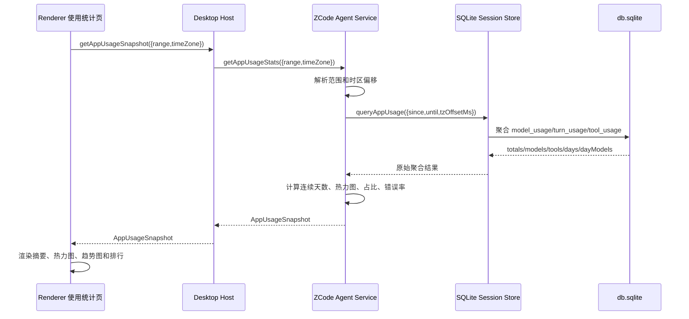

# ZCode 使用统计数据存储、读取路径与提取逻辑调查

## 1. 文档目的

本文说明 ZCode 桌面端“使用统计 → 应用用量”页面的数据：

1. 持久化在本机什么位置。
2. SQLite 数据表如何组织。
3. 从前端页面到 SQLite 的完整读取路径。
4. ZCode 源码中统计查询、区间处理、连续活跃天数及图表数据的完整逻辑。
5. 如何使用独立代码安全地读取和导出数据。
6. 本次调查使用了哪些方法、得到哪些证据。

目标读者为需要排查 ZCode 本地数据、复核统计数字或自行导出用量记录的开发人员和系统管理员。

本文只分析“应用用量”。“编程套餐”读取 Z.ai / BigModel Coding Plan 的远端额度，属于另一条数据链路。

---

## 2. 核心结论

### 2.1 持久化位置

“应用用量”的主数据源是：

```text
C:\Users\Administrator\.zcode\cli\db\db.sqlite
```

ZCode 运行期间还会使用 SQLite WAL 文件：

```text
C:\Users\Administrator\.zcode\cli\db\db.sqlite-wal
C:\Users\Administrator\.zcode\cli\db\db.sqlite-shm
```

数据库启动日志明确记录了该路径：

```json
{
  "event": "zcode_protocol.startup.sqlite_migration.started",
  "context": {
    "dbPath": "C:\\Users\\Administrator\\.zcode\\cli\\db\\db.sqlite"
  }
}
```

日志文件位于：

```text
C:\Users\Administrator\.zcode\cli\log\zcode-2026-09-01.jsonl
```

#### 2.1.1 Windows、macOS、Linux 的默认数据库位置

安装包中的数据库路径函数没有针对 Windows、macOS 或 Linux 分支，而是统一使用 Node.js `os.homedir()`：

```js
function getDefaultSessionDbPath() {
  return path.join(
    os.homedir(),
    ".zcode",
    "cli",
    "db",
    "db.sqlite",
  );
}
```

SQLite Store 构造函数的真实规则是：

```js
class SqliteSessionStore {
  constructor(options = {}) {
    this.dbPath = options.dbPath ?? getDefaultSessionDbPath();
    ensureParentDir(this.dbPath);
    this.db = new DatabaseSync(this.dbPath, { timeout });
  }
}
```

因此，跨平台的规范表达式是：

```text
<os.homedir()>/.zcode/cli/db/db.sqlite
```

各平台默认位置：

| 平台 | 默认主目录 | 应用用量数据库 | 证据状态 |
|---|---|---|---|
| Windows | `%USERPROFILE%`，通常为 `C:\Users\<用户名>` | `%USERPROFILE%\.zcode\cli\db\db.sqlite` | 已在当前机器实测并由启动日志确认 |
| macOS | `$HOME`，通常为 `/Users/<用户名>` | `$HOME/.zcode/cli/db/db.sqlite`，通常为 `/Users/<用户名>/.zcode/cli/db/db.sqlite` | 由同版本跨平台源码和 Node.js 主目录规则确定 |
| Linux | `$HOME`，普通用户通常为 `/home/<用户名>` | `$HOME/.zcode/cli/db/db.sqlite`，通常为 `/home/<用户名>/.zcode/cli/db/db.sqlite` | 由同版本跨平台源码和 Node.js 主目录规则确定 |
| WSL/WSLg 中运行 Linux 版 | 当前 Linux 用户的 `$HOME` | `/home/<Linux 用户>/.zcode/cli/db/db.sqlite` | 与 Linux 版相同；不是 Windows 用户目录 |

对应的 WAL 文件在相同目录：

```text
db.sqlite-wal
db.sqlite-shm
```

官方安装文档确认 ZCode 3.10.2 同时提供 macOS、Windows 和 Linux 安装包。当前 Windows 安装包内的 Agent 数据库代码直接调用 `node:os.homedir()`，该实现不存在 `process.platform` 判断，也没有使用 Electron `app.getPath("userData")` 或 Linux `XDG_CONFIG_HOME` 计算此数据库路径。因此：

- macOS 数据库不在 `~/Library/Application Support/ZCode` 下。
- Linux 数据库不在 `~/.config/ZCode` 下。
- 上述目录可能保存 Electron 页面状态、缓存或会话存储，但不是本文分析的 Agent 用量 SQLite 数据库。
- CPU 架构不改变路径：macOS Apple Silicon/Intel、Windows x64/ARM64、Linux x64/ARM64 使用同一主目录相对路径。

Node.js 官方文档对 `os.homedir()` 的规则是：

- POSIX（macOS、Linux）：优先读取 `$HOME`；未定义时按有效 UID 查询用户主目录。
- Windows：优先读取 `USERPROFILE`；未定义时读取当前用户的系统配置文件目录。

因此，如果服务进程显式修改了 `$HOME` 或 `USERPROFILE`，数据库会随 `os.homedir()` 改到对应位置。`SqliteSessionStore` 内部也允许调用方传入 `options.dbPath` 覆盖默认值；常规桌面端启动使用默认路径，特殊测试或定制宿主应以启动日志中的 `dbPath` 为最终事实。

跨平台功能代码不要硬编码用户名或操作系统目录。推荐直接计算：

```python
from pathlib import Path

db_path = Path.home() / ".zcode" / "cli" / "db" / "db.sqlite"
print(db_path)
```

Node.js 等价实现：

```js
import { homedir } from "node:os";
import { join } from "node:path";

const dbPath = join(homedir(), ".zcode", "cli", "db", "db.sqlite");
console.log(dbPath);
```

各平台终端快速查看：

```powershell
# Windows PowerShell
Join-Path $HOME ".zcode\cli\db\db.sqlite"
```

```bash
# macOS / Linux / WSL
printf '%s\n' "$HOME/.zcode/cli/db/db.sqlite"
```

Linux 官方排查文档建议以普通用户运行 ZCode，不要使用 `sudo`。如果错误地使用 `sudo` 或以 root 账户运行，`os.homedir()` 可能返回 `/root`，数据库会落到：

```text
/root/.zcode/cli/db/db.sqlite
```

这会导致普通用户再次启动 ZCode 时看不到 root 账户下的历史统计，并产生权限和数据分裂问题。

资料来源：

- [ZCode 官方安装文档](https://zcode.z.ai/cn/docs/install)：确认 macOS、Windows、Linux 安装包和架构支持范围。
- [ZCode Linux / WSL 排查指南](https://zcode.z.ai/cn/docs/linux-wsl)：确认 Linux 版应由普通用户启动。
- [Node.js `os.homedir()` 官方文档](https://nodejs.org/api/os.html#oshomedir)：确认 POSIX `$HOME`、Windows `USERPROFILE` 的解析规则。

### 2.2 页面数据来源

页面返回的快照在进程内存中包含：

```json
{
  "source": "agent-db"
}
```

因此，“应用用量”来自本地 Agent SQLite 数据库，不来自 Coding Plan 远端统计接口。

### 2.3 当前数据库复核结果

本次调查时，数据库中的摘要值为：

| 指标 | 原始值 | 界面格式化结果 |
|---|---:|---:|
| 累计 Token | 156,667,638 | 约 1.6 亿 |
| 峰值单日 Token | 120,698,093 | 约 1.2 亿 |
| 最长会话 | 14,457,943 ms | 4 小时 00 分 57.943 秒 |
| 有用量记录的会话 | 9 | 9 |
| Turn 数 | 32 | 32 |
| 工具调用数 | 680 | 680 |
| 活跃天数 | 4 | 4 |
| 当前连续活跃天数 | 0 | 0 |
| 最长连续活跃天数 | 3 | 3 |

页面截图与数据库聚合结果一致。

### 2.4 重要保留期限

当前安装版本的源码将用量明细保留期限定义为 30 天：

```js
const usageRetentionDays = 30;
const usageRetentionMs = usageRetentionDays * 24 * 60 * 60 * 1000;
```

清理逻辑会删除早于 `Date.now() - usageRetentionMs` 的三类记录：

```sql
delete from model_usage where started_at < ?;
delete from turn_usage  where started_at < ?;
delete from tool_usage  where started_at < ?;
```

因此，页面中的“全部时间”实际表示“当前数据库仍保留的全部记录”，不保证覆盖超过 30 天的历史。界面热力图可以显示更长的时间轴，但底层用量明细可能已被自动清理。

---

## 3. 调查对象和版本

本次检查的 ZCode 安装信息：

```text
安装目录：D:\Program Files (x86)\zcode
桌面端版本：3.10.1
Agent/Protocol 数据版本：0.16.5
Electron：41.0.3
```

应用元数据来自：

```text
D:\Program Files (x86)\zcode\resources\app.asar\package.json
```

关键实现文件：

```text
D:\Program Files (x86)\zcode\resources\app.asar
D:\Program Files (x86)\zcode\resources\glm\zcode.cjs
```

`app.asar` 包含桌面端 Renderer、Host 和 Main 代码；`resources\glm\zcode.cjs` 包含 Agent 服务、SQLite 存储和统计聚合逻辑。

---

## 4. 数据表关系



外键关系：

| 源表 | 源字段 | 目标表 | 目标字段 | 删除行为 |
|---|---|---|---|---|
| `message` | `session_id` | `session` | `id` | CASCADE |
| `part` | `message_id` | `message` | `id` | CASCADE |
| `model_usage` | `session_id` | `session` | `id` | CASCADE |
| `turn_usage` | `session_id` | `session` | `id` | CASCADE |
| `tool_usage` | `session_id` | `session` | `id` | CASCADE |

本次调查时的行数：

| 表 | 行数 |
|---|---:|
| `session` | 10 |
| `message` | 634 |
| `part` | 2,276 |
| `model_usage` | 548 |
| `turn_usage` | 32 |
| `tool_usage` | 680 |

---

## 5. 数据表结构

### 5.1 `model_usage`

用途：每次模型请求一条记录，是累计 Token、每日 Token、模型排行、缓存命中率和模型错误率的主数据源。

主键：`id`

外键：`session_id → session.id ON DELETE CASCADE`

| 字段 | 类型 | 必填 | 默认值 | 含义 |
|---|---|---:|---|---|
| `id` | TEXT | 是 | — | 用量记录 ID |
| `logical_request_id` | TEXT | 是 | — | 逻辑请求 ID；重试可能共享该 ID |
| `attempt_index` | INTEGER | 是 | 0 | 当前请求尝试序号 |
| `session_id` | TEXT | 是 | — | 所属会话 |
| `turn_id` | TEXT | 否 | NULL | 所属 Turn |
| `trace_id` | TEXT | 否 | NULL | 调用链 Trace ID |
| `span_id` | TEXT | 否 | NULL | 调用链 Span ID |
| `assistant_message_id` | TEXT | 否 | NULL | 助手消息 ID |
| `parent_user_message_id` | TEXT | 否 | NULL | 父用户消息 ID |
| `query_source` | TEXT | 是 | — | 请求来源，如 `main_turn`、`subagent` |
| `provider_id` | TEXT | 是 | — | 模型供应商 ID |
| `model_id` | TEXT | 是 | — | 模型 ID |
| `variant` | TEXT | 否 | NULL | 推理等级或模型变体 |
| `agent` | TEXT | 否 | NULL | Agent 名称 |
| `mode` | TEXT | 否 | NULL | 运行模式 |
| `task_type` | TEXT | 否 | NULL | 任务类型 |
| `status` | TEXT | 是 | — | `running/completed/error/cancelled` |
| `started_at` | INTEGER | 是 | — | 开始时间，Unix 毫秒 |
| `first_token_at` | INTEGER | 否 | NULL | 首 Token 时间，Unix 毫秒 |
| `completed_at` | INTEGER | 否 | NULL | 完成时间，Unix 毫秒 |
| `duration_ms` | INTEGER | 否 | NULL | 请求总耗时 |
| `time_to_first_token_ms` | INTEGER | 否 | NULL | 首 Token 延迟 |
| `finish_reason` | TEXT | 否 | NULL | 模型结束原因 |
| `tool_call_count` | INTEGER | 是 | 0 | 本次模型输出中的工具调用数 |
| `input_tokens` | INTEGER | 是 | 0 | 输入 Token |
| `output_tokens` | INTEGER | 是 | 0 | 输出 Token |
| `reasoning_tokens` | INTEGER | 是 | 0 | 推理 Token |
| `cache_creation_input_tokens` | INTEGER | 是 | 0 | 写入缓存的输入 Token |
| `cache_read_input_tokens` | INTEGER | 是 | 0 | 从缓存读取的输入 Token |
| `provider_total_tokens` | INTEGER | 否 | NULL | 供应商返回的总 Token |
| `computed_total_tokens` | INTEGER | 是 | 0 | ZCode 归一化后的总 Token；页面主要使用该字段 |
| `retry_count` | INTEGER | 是 | 0 | 重试次数 |
| `retryable` | INTEGER | 是 | 0 | 是否可重试，0/1 |
| `cancelled_by_user` | INTEGER | 是 | 0 | 是否由用户取消，0/1 |
| `context_exceeded` | INTEGER | 是 | 0 | 是否超过上下文，0/1 |
| `error_type` | TEXT | 否 | NULL | 错误类型 |
| `error_code` | TEXT | 否 | NULL | 错误码 |
| `error_message` | TEXT | 否 | NULL | 错误消息 |
| `raw_usage_json` | TEXT | 否 | NULL | 供应商原始用量 JSON |
| `provider_metadata_json` | TEXT | 否 | NULL | 供应商附加元数据 JSON |

索引：

```sql
CREATE INDEX model_usage_started_model_idx
    ON model_usage(started_at, provider_id, model_id);

CREATE INDEX model_usage_session_turn_idx
    ON model_usage(session_id, turn_id);

CREATE INDEX model_usage_trace_idx
    ON model_usage(trace_id);

CREATE INDEX model_usage_query_source_idx
    ON model_usage(query_source);
```

### 5.2 `turn_usage`

用途：每个用户交互 Turn 一条记录，用于 Turn 数、平均 Turn 时长、会话累计时长和 Turn 级 Token 汇总。

复合主键：`(session_id, turn_id)`

外键：`session_id → session.id ON DELETE CASCADE`

| 字段 | 类型 | 必填 | 默认值 | 含义 |
|---|---|---:|---|---|
| `session_id` | TEXT | 是 | — | 会话 ID，主键第 1 列 |
| `turn_id` | TEXT | 是 | — | Turn ID，主键第 2 列 |
| `trace_id` | TEXT | 否 | NULL | Trace ID |
| `user_message_id` | TEXT | 否 | NULL | 用户消息 ID |
| `status` | TEXT | 是 | — | `running/completed/error/cancelled` |
| `started_at` | INTEGER | 是 | — | 开始时间，Unix 毫秒 |
| `first_model_start_at` | INTEGER | 否 | NULL | 首次模型请求开始时间 |
| `first_token_at` | INTEGER | 否 | NULL | 首 Token 时间 |
| `completed_at` | INTEGER | 否 | NULL | 完成时间 |
| `duration_ms` | INTEGER | 否 | NULL | Turn 总耗时 |
| `time_to_first_token_ms` | INTEGER | 否 | NULL | 首 Token 延迟 |
| `model_request_count` | INTEGER | 是 | 0 | 模型请求次数 |
| `model_retry_count` | INTEGER | 是 | 0 | 模型重试次数 |
| `tool_call_count` | INTEGER | 是 | 0 | 工具调用次数 |
| `tool_error_count` | INTEGER | 是 | 0 | 工具错误次数 |
| `input_tokens` | INTEGER | 是 | 0 | 输入 Token |
| `output_tokens` | INTEGER | 是 | 0 | 输出 Token |
| `reasoning_tokens` | INTEGER | 是 | 0 | 推理 Token |
| `cache_creation_input_tokens` | INTEGER | 是 | 0 | 缓存创建 Token |
| `cache_read_input_tokens` | INTEGER | 是 | 0 | 缓存读取 Token |
| `computed_total_tokens` | INTEGER | 是 | 0 | 归一化后的总 Token |
| `retryable` | INTEGER | 是 | 0 | 是否可重试 |
| `cancelled_by_user` | INTEGER | 是 | 0 | 是否由用户取消 |
| `context_exceeded` | INTEGER | 是 | 0 | 是否超过上下文 |
| `error_type` | TEXT | 否 | NULL | 错误类型 |
| `error_code` | TEXT | 否 | NULL | 错误码 |

索引：

```sql
CREATE INDEX turn_usage_started_idx
    ON turn_usage(started_at);
```

### 5.3 `tool_usage`

用途：每次工具调用一条记录，用于工具总调用数、错误率、工具排行及平均耗时。

主键：`id`

外键：`session_id → session.id ON DELETE CASCADE`

| 字段 | 类型 | 必填 | 默认值 | 含义 |
|---|---|---:|---|---|
| `id` | TEXT | 是 | — | 用量记录 ID |
| `session_id` | TEXT | 是 | — | 会话 ID |
| `turn_id` | TEXT | 否 | NULL | Turn ID |
| `trace_id` | TEXT | 否 | NULL | Trace ID |
| `tool_call_id` | TEXT | 是 | — | 工具调用 ID |
| `tool_name` | TEXT | 是 | — | 工具名称 |
| `side_effect_scope` | TEXT | 否 | NULL | 副作用范围 |
| `read_only` | INTEGER | 否 | NULL | 是否只读 |
| `destructive` | INTEGER | 否 | NULL | 是否具有破坏性 |
| `approval_status` | TEXT | 否 | NULL | 授权状态 |
| `status` | TEXT | 是 | — | `running/completed/error/cancelled` |
| `started_at` | INTEGER | 是 | — | 开始时间，Unix 毫秒 |
| `first_output_at` | INTEGER | 否 | NULL | 首次输出时间 |
| `completed_at` | INTEGER | 否 | NULL | 完成时间 |
| `duration_ms` | INTEGER | 否 | NULL | 调用耗时 |
| `time_to_first_output_ms` | INTEGER | 否 | NULL | 首次输出延迟 |
| `exit_code` | INTEGER | 否 | NULL | 进程退出码 |
| `output_bytes` | INTEGER | 是 | 0 | 总输出字节数 |
| `stdout_bytes` | INTEGER | 是 | 0 | 标准输出字节数 |
| `stderr_bytes` | INTEGER | 是 | 0 | 标准错误字节数 |
| `truncated` | INTEGER | 是 | 0 | 输出是否截断 |
| `retry_count` | INTEGER | 是 | 0 | 重试次数 |
| `retryable` | INTEGER | 是 | 0 | 是否可重试 |
| `cancelled_by_user` | INTEGER | 是 | 0 | 是否由用户取消 |
| `error_type` | TEXT | 否 | NULL | 错误类型 |
| `error_code` | TEXT | 否 | NULL | 错误码 |
| `error_message` | TEXT | 否 | NULL | 错误消息 |

索引：

```sql
CREATE UNIQUE INDEX tool_usage_session_tool_call_idx
    ON tool_usage(session_id, tool_call_id);

CREATE INDEX tool_usage_session_turn_idx
    ON tool_usage(session_id, turn_id);

CREATE INDEX tool_usage_started_tool_idx
    ON tool_usage(started_at, tool_name);
```

### 5.4 `session`

用途：会话元数据。统计代码通过其他用量表中的 `session_id` 间接引用它。

关键字段：

| 字段 | 类型 | 含义 |
|---|---|---|
| `id` | TEXT | 会话主键 |
| `project_id` | TEXT | 项目 ID |
| `workspace_id` | TEXT | 工作区 ID |
| `parent_id` | TEXT | 父会话 ID |
| `directory` | TEXT | 会话工作目录 |
| `path` | TEXT | 工作区路径 |
| `title` | TEXT | 会话标题 |
| `version` | TEXT | Agent 数据版本 |
| `time_created` | INTEGER | 创建时间 |
| `time_updated` | INTEGER | 更新时间 |
| `time_archived` | INTEGER | 归档时间 |
| `task_type` | TEXT | 任务类型，默认 `interactive` |
| `trace_id` | TEXT | Trace ID |

注意：最长会话并不使用 `time_updated - time_created`。源码会按 `session_id` 汇总已完成 Turn 的 `duration_ms`，再取最大值。

### 5.5 `message`

| 字段 | 类型 | 含义 |
|---|---|---|
| `id` | TEXT | 消息主键 |
| `session_id` | TEXT | 所属会话 |
| `time_created` | INTEGER | 创建时间 |
| `time_updated` | INTEGER | 更新时间 |
| `data` | TEXT | 消息 JSON 数据 |
| `sequence` | INTEGER | 会话内顺序 |

`data` 可能包含用户输入、助手输出或其他消息元数据，属于敏感数据。

### 5.6 `part`

| 字段 | 类型 | 含义 |
|---|---|---|
| `id` | TEXT | Part 主键 |
| `message_id` | TEXT | 所属消息 |
| `session_id` | TEXT | 所属会话 |
| `time_created` | INTEGER | 创建时间 |
| `time_updated` | INTEGER | 更新时间 |
| `data` | TEXT | Part JSON 数据 |
| `sequence` | INTEGER | 消息内顺序 |

`part.data` 可能包含文本、工具调用和工具输出，导出时需要按敏感数据处理。

---

## 6. ZCode 源码中的完整读取路径

### 6.1 调用链



### 6.2 Renderer：请求本地快照

来源：

```text
resources/app.asar/out/renderer/assets/styles-C2WGZ-SY.js
```

原始构建产物经过压缩。下面保持其行为不变，仅恢复变量名和排版：

```js
function useAppUsageStats(range) {
  const { usageStatsService } = useServices();
  const [state, setState] = useState({
    snapshot: null,
    loading: false,
    error: null,
  });
  const requestIdRef = useRef(0);

  const refresh = useCallback(async () => {
    const requestId = requestIdRef.current + 1;
    requestIdRef.current = requestId;

    const timeZone = Intl.DateTimeFormat()
      .resolvedOptions()
      .timeZone;

    setState(previous => ({
      snapshot: previous.snapshot,
      loading: true,
      error: null,
    }));

    try {
      const snapshot = await usageStatsService.getAppUsageSnapshot({
        range,
        timeZone,
      });

      // 丢弃已被新请求取代的响应。
      if (requestIdRef.current !== requestId) return;

      setState({
        snapshot,
        loading: false,
        error: null,
      });
    } catch (error) {
      if (requestIdRef.current !== requestId) return;

      const message = normalizeError(error);
      logger.warn("[useAppUsageStats] 读取本地使用统计失败", {
        range,
        timeZone,
        error: message,
      });

      setState(previous => ({
        snapshot: previous.snapshot,
        loading: false,
        error: message,
      }));
    }
  }, [range, usageStatsService]);

  useEffect(() => {
    refresh();
  }, [refresh]);

  return {
    ...state,
    refresh,
  };
}
```

关键点：

- 时区取自当前操作系统/Chromium 的 `Intl.DateTimeFormat().resolvedOptions().timeZone`。
- 页面切换区间时重新请求快照。
- 使用递增请求编号，避免较旧的异步响应覆盖新结果。
- 请求失败时保留旧快照，只更新错误状态。

### 6.3 Host：区分本地应用用量和远端套餐用量

来源：

```text
resources/app.asar/out/host/index.js
```

```js
function createUsageStatsService(deps) {
  const codingPlanService = new CodingPlanUsageService({
    apiClient: deps.apiClient,
    modelProviderService: deps.modelProviderService,
    credentialService: deps.credentialService,
    env: deps.env,
    ...(deps.officialMcpCredentialSource
      ? { officialMcpCredentialSource: deps.officialMcpCredentialSource }
      : {}),
  });

  return {
    async getAppUsageSnapshot(request) {
      return deps.zcodeAgentService.getAppUsageStats({
        range: request.range,
        timeZone: request.timeZone,
      });
    },

    async getCodingPlanUsageSnapshot(request) {
      // 这条分支读取远端 Coding Plan；与应用用量不是同一来源。
      if (!isCodingPlanProviderId(request.preferredProviderId)) {
        throw new Error("no_bigmodel_api_key");
      }
      return codingPlanService.getCodingPlanUsageSnapshot(request);
    },
  };
}
```

该分支是本地与远端统计的明确边界：

- `getAppUsageSnapshot` → `zcodeAgentService` → 本地 Agent 数据库。
- `getCodingPlanUsageSnapshot` → Coding Plan API → 远端额度数据。

### 6.4 Agent 服务：解析时间范围

来源：

```text
resources/glm/zcode.cjs
```

构建产物中的函数名为 `Sbt`，注册名为 `getUsageStats`；Host 客户端将其暴露为 `getAppUsageStats`。按真实语义恢复名称后：

```js
async function getAppUsageStats(service, rawRequest) {
  const request = appUsageRequestSchema.parse(rawRequest ?? {});
  const timeZone = request.timeZone ?? "UTC";
  const now = Date.now();

  const tzOffsetMs = resolveTzOffsetMs(timeZone, now);
  const rangeDays = {
    "7d": 7,
    "30d": 30,
    // 源码只显式映射 7d 和 30d；all 在下一步单独处理。
  }[request.range] ?? 30;

  const since = request.range === "all"
    ? 0
    : now - rangeDays * 86_400_000;

  const range = {
    range: request.range,
    timeZone,
    tzOffsetMs,
    generatedAt: now,
    since,
    until: now,
  };

  const sessionStore = service.deps.sessionStore;

  // 存储层不可用时仍返回结构完整的空快照。
  if (!sessionStore?.queryAppUsage) {
    return buildAppUsageSnapshot(
      {
        totals: {
          totalTokens: 0,
          inputTokens: 0,
          outputTokens: 0,
          reasoningTokens: 0,
          cacheCreationTokens: 0,
          cacheReadTokens: 0,
          modelRequestCount: 0,
          modelErrorCount: 0,
          avgTimeToFirstTokenMs: null,
        },
        turnTotals: {
          totalSessions: 0,
          totalTurns: 0,
          avgTurnDurationMs: null,
          longestSessionMs: 0,
        },
        toolTotals: {
          toolCallCount: 0,
          toolErrorCount: 0,
        },
        models: [],
        tools: [],
        days: [],
        dayModels: [],
      },
      range,
    );
  }

  const rawStats = await sessionStore.queryAppUsage({
    since,
    until: now,
    tzOffsetMs,
  });

  return buildAppUsageSnapshot(rawStats, range);
}
```

### 6.5 SQLite Store：完整聚合查询

构建产物中的函数名为 `h6t`，注册名为 `queryAppUsage`。下面是完整等价逻辑；SQL、过滤条件和返回字段均与安装包一致：

```js
async function queryAppUsage(db, options) {
  const { since, until, tzOffsetMs } = options;
  const DAY_MS = 86_400_000;

  const totalsRow = db.prepare(`
    select
      coalesce(sum(computed_total_tokens), 0) as totalTokens,
      coalesce(sum(input_tokens), 0) as inputTokens,
      coalesce(sum(output_tokens), 0) as outputTokens,
      coalesce(sum(reasoning_tokens), 0) as reasoningTokens,
      coalesce(sum(cache_creation_input_tokens), 0) as cacheCreationTokens,
      coalesce(sum(cache_read_input_tokens), 0) as cacheReadTokens,
      count(*) as modelRequestCount,
      coalesce(sum(case when status = 'error' then 1 else 0 end), 0)
        as modelErrorCount,
      avg(time_to_first_token_ms) as avgTimeToFirstTokenMs
    from model_usage
    where started_at >= ? and started_at <= ?
  `).get(since, until);

  const turnTotalsRow = db.prepare(`
    select
      count(distinct session_id) as totalSessions,
      count(*) as totalTurns,
      avg(case when status = 'completed' then duration_ms else null end)
        as avgTurnDurationMs
    from turn_usage
    where started_at >= ? and started_at <= ?
  `).get(since, until);

  const longestSessionRow = db.prepare(`
    select coalesce(max(sessionDurationMs), 0) as longestSessionMs
    from (
      select
        coalesce(
          sum(case when status = 'completed' then duration_ms else 0 end),
          0
        ) as sessionDurationMs
      from turn_usage
      where started_at >= ? and started_at <= ?
      group by session_id
    )
  `).get(since, until);

  const toolTotalsRow = db.prepare(`
    select
      count(*) as toolCallCount,
      coalesce(sum(case when status = 'error' then 1 else 0 end), 0)
        as toolErrorCount
    from tool_usage
    where started_at >= ? and started_at <= ?
  `).get(since, until);

  const modelRows = db.prepare(`
    select
      model_id as modelId,
      coalesce(sum(computed_total_tokens), 0) as totalTokens,
      coalesce(sum(input_tokens), 0) as inputTokens,
      coalesce(sum(output_tokens), 0) as outputTokens,
      count(*) as requestCount
    from model_usage
    where started_at >= ? and started_at <= ?
    group by model_id
    order by totalTokens desc
  `).all(since, until);

  const toolRows = db.prepare(`
    select
      tool_name as toolName,
      count(*) as callCount,
      coalesce(sum(case when status = 'error' then 1 else 0 end), 0)
        as errorCount,
      avg(duration_ms) as avgDurationMs
    from tool_usage
    where started_at >= ? and started_at <= ?
    group by tool_name
    order by callCount desc
  `).all(since, until);

  const dayRows = db.prepare(`
    select
      cast((started_at + ?) / ? as integer) as dayIndex,
      coalesce(sum(computed_total_tokens), 0) as totalTokens
    from model_usage
    where started_at >= ? and started_at <= ?
    group by dayIndex
  `).all(tzOffsetMs, DAY_MS, since, until);

  const dayTurnRows = db.prepare(`
    select
      cast((started_at + ?) / ? as integer) as dayIndex,
      count(*) as turnCount
    from turn_usage
    where started_at >= ? and started_at <= ?
    group by dayIndex
  `).all(tzOffsetMs, DAY_MS, since, until);

  const dayToolRows = db.prepare(`
    select
      cast((started_at + ?) / ? as integer) as dayIndex,
      count(*) as toolCallCount
    from tool_usage
    where started_at >= ? and started_at <= ?
    group by dayIndex
  `).all(tzOffsetMs, DAY_MS, since, until);

  const days = new Map();

  for (const row of dayRows) {
    days.set(row.dayIndex, {
      dayIndex: row.dayIndex,
      totalTokens: Number(row.totalTokens),
      turnCount: 0,
      toolCallCount: 0,
    });
  }

  for (const row of dayTurnRows) {
    const day = days.get(row.dayIndex) ?? {
      dayIndex: row.dayIndex,
      totalTokens: 0,
      turnCount: 0,
      toolCallCount: 0,
    };
    day.turnCount = Number(row.turnCount);
    days.set(row.dayIndex, day);
  }

  for (const row of dayToolRows) {
    const day = days.get(row.dayIndex) ?? {
      dayIndex: row.dayIndex,
      totalTokens: 0,
      turnCount: 0,
      toolCallCount: 0,
    };
    day.toolCallCount = Number(row.toolCallCount);
    days.set(row.dayIndex, day);
  }

  const dayModelRows = db.prepare(`
    select
      cast((started_at + ?) / ? as integer) as dayIndex,
      model_id as modelId,
      coalesce(sum(computed_total_tokens), 0) as totalTokens
    from model_usage
    where started_at >= ? and started_at <= ?
    group by dayIndex, model_id
  `).all(tzOffsetMs, DAY_MS, since, until);

  return {
    totals: {
      totalTokens: Number(totalsRow.totalTokens ?? 0),
      inputTokens: Number(totalsRow.inputTokens ?? 0),
      outputTokens: Number(totalsRow.outputTokens ?? 0),
      reasoningTokens: Number(totalsRow.reasoningTokens ?? 0),
      cacheCreationTokens: Number(totalsRow.cacheCreationTokens ?? 0),
      cacheReadTokens: Number(totalsRow.cacheReadTokens ?? 0),
      modelRequestCount: Number(totalsRow.modelRequestCount ?? 0),
      modelErrorCount: Number(totalsRow.modelErrorCount ?? 0),
      avgTimeToFirstTokenMs:
        totalsRow.avgTimeToFirstTokenMs == null
          ? null
          : Number(totalsRow.avgTimeToFirstTokenMs),
    },
    turnTotals: {
      totalSessions: Number(turnTotalsRow.totalSessions ?? 0),
      totalTurns: Number(turnTotalsRow.totalTurns ?? 0),
      avgTurnDurationMs:
        turnTotalsRow.avgTurnDurationMs == null
          ? null
          : Number(turnTotalsRow.avgTurnDurationMs),
      longestSessionMs: Number(longestSessionRow.longestSessionMs ?? 0),
    },
    toolTotals: {
      toolCallCount: Number(toolTotalsRow.toolCallCount ?? 0),
      toolErrorCount: Number(toolTotalsRow.toolErrorCount ?? 0),
    },
    models: modelRows.map(row => ({
      modelId: row.modelId ?? null,
      totalTokens: Number(row.totalTokens),
      inputTokens: Number(row.inputTokens),
      outputTokens: Number(row.outputTokens),
      requestCount: Number(row.requestCount),
    })),
    tools: toolRows.map(row => ({
      toolName: row.toolName,
      callCount: Number(row.callCount),
      errorCount: Number(row.errorCount),
      avgDurationMs:
        row.avgDurationMs == null ? null : Number(row.avgDurationMs),
    })),
    days: [...days.values()].sort(
      (left, right) => left.dayIndex - right.dayIndex,
    ),
    dayModels: dayModelRows.map(row => ({
      dayIndex: Number(row.dayIndex),
      modelId: row.modelId ?? null,
      totalTokens: Number(row.totalTokens),
    })),
  };
}
```

注意：这些查询没有过滤掉 `error` 或 `cancelled`。所有区间内记录都会计入请求数；错误和取消记录通常 Token 为 0，因此不会改变当前累计 Token，但会影响请求数和错误率。

### 6.6 快照组装：连续天数、热力图、模型占比

构建产物中的函数名为 `ubt`，注册名为 `buildAppUsageSnapshot`。完整等价逻辑如下：

```js
function buildAppUsageSnapshot(raw, range) {
  const { totals, turnTotals, toolTotals } = raw;

  const effectiveInputTokens = totals.inputTokens > 0
    ? totals.inputTokens
    : totals.cacheCreationTokens + totals.cacheReadTokens;

  const cacheHitRate = effectiveInputTokens > 0
    ? totals.cacheReadTokens / effectiveInputTokens
    : 0;

  const modelErrorRate = totals.modelRequestCount > 0
    ? totals.modelErrorCount / totals.modelRequestCount
    : 0;

  const toolErrorRate = toolTotals.toolCallCount > 0
    ? toolTotals.toolErrorCount / toolTotals.toolCallCount
    : 0;

  const daysByIndex = new Map();
  for (const day of raw.days) {
    daysByIndex.set(day.dayIndex, {
      totalTokens: day.totalTokens,
      turnCount: day.turnCount,
      toolCallCount: day.toolCallCount,
    });
  }

  const endDayIndex = Math.floor(
    (range.until + range.tzOffsetMs) / 86_400_000,
  );

  let startDayIndex;
  if (range.range !== "all") {
    startDayIndex = Math.floor(
      (range.since + range.tzOffsetMs) / 86_400_000,
    );
  } else {
    const observedIndexes = [
      ...raw.days.map(day => day.dayIndex),
      ...raw.dayModels.map(day => day.dayIndex),
    ];
    startDayIndex = observedIndexes.length === 0
      ? endDayIndex
      : Math.min(...observedIndexes);
  }

  let activeDays = 0;
  let currentStreakDays = 0;
  let longestStreakDays = 0;
  let runningStreak = 0;
  let currentStreakEnded = false;

  // 从今天向过去扫描。
  for (let dayIndex = endDayIndex;
       dayIndex >= startDayIndex;
       dayIndex -= 1) {
    const active = (daysByIndex.get(dayIndex)?.totalTokens ?? 0) > 0;

    if (active) {
      activeDays += 1;
      runningStreak += 1;
      longestStreakDays = Math.max(longestStreakDays, runningStreak);

      if (!currentStreakEnded) {
        currentStreakDays += 1;
      }
    } else {
      if (!currentStreakEnded) {
        currentStreakEnded = true;
      }
      runningStreak = 0;
    }
  }

  const peakDayTokens = raw.days.reduce(
    (maximum, day) => Math.max(maximum, day.totalTokens),
    0,
  );

  const heatmapWeeks = [];
  let heatmapWeek = [];

  for (let dayIndex = startDayIndex;
       dayIndex <= endDayIndex;
       dayIndex += 1) {
    const day = daysByIndex.get(dayIndex);
    const totalTokens = day?.totalTokens ?? 0;

    let level = 0;
    if (totalTokens > 0 && peakDayTokens > 0) {
      const ratio = totalTokens / peakDayTokens;
      level = ratio > 0.75 ? 4
        : ratio > 0.50 ? 3
        : ratio > 0.25 ? 2
        : 1;
    }

    heatmapWeek.push({
      date: new Date(dayIndex * 86_400_000)
        .toISOString()
        .slice(0, 10),
      level,
      totalTokens,
      turnCount: day?.turnCount ?? 0,
      toolCallCount: day?.toolCallCount ?? 0,
    });

    if (heatmapWeek.length === 7) {
      heatmapWeeks.push({
        weekIndex: heatmapWeeks.length,
        days: heatmapWeek,
      });
      heatmapWeek = [];
    }
  }

  if (heatmapWeek.length > 0) {
    while (heatmapWeek.length < 7) {
      heatmapWeek.push(null);
    }
    heatmapWeeks.push({
      weekIndex: heatmapWeeks.length,
      days: heatmapWeek,
    });
  }

  const dailyModelsMap = new Map();
  for (const row of raw.dayModels) {
    const models = dailyModelsMap.get(row.dayIndex) ?? new Map();
    models.set(
      row.modelId,
      (models.get(row.modelId) ?? 0) + row.totalTokens,
    );
    dailyModelsMap.set(row.dayIndex, models);
  }

  const dailyModelUsage = [];
  for (let dayIndex = startDayIndex;
       dayIndex <= endDayIndex;
       dayIndex += 1) {
    const models = dailyModelsMap.get(dayIndex);
    dailyModelUsage.push({
      date: new Date(dayIndex * 86_400_000)
        .toISOString()
        .slice(0, 10),
      models: models
        ? [...models.entries()].map(([modelId, totalTokens]) => ({
            modelId,
            totalTokens,
          }))
        : [],
    });
  }

  const allModelTokens = raw.models.reduce(
    (sum, model) => sum + model.totalTokens,
    0,
  );

  const models = raw.models.map(model => ({
    modelId: model.modelId,
    totalTokens: model.totalTokens,
    inputTokens: model.inputTokens,
    outputTokens: model.outputTokens,
    requestCount: model.requestCount,
    share: allModelTokens > 0
      ? model.totalTokens / allModelTokens
      : 0,
  }));

  const favoriteModel = models.length > 0
    ? {
        modelId: models[0].modelId,
        totalTokens: models[0].totalTokens,
        share: models[0].share,
      }
    : null;

  const tools = raw.tools.map(tool => ({
    toolName: tool.toolName,
    callCount: tool.callCount,
    errorCount: tool.errorCount,
    errorRate: tool.callCount > 0
      ? tool.errorCount / tool.callCount
      : 0,
    avgDurationMs: tool.avgDurationMs,
  }));

  return {
    range: range.range,
    generatedAt: range.generatedAt,
    timeZone: range.timeZone,
    source: "agent-db",
    summary: {
      totalTokens: totals.totalTokens,
      inputTokens: totals.inputTokens,
      outputTokens: totals.outputTokens,
      reasoningTokens: totals.reasoningTokens,
      cacheCreationTokens: totals.cacheCreationTokens,
      cacheReadTokens: totals.cacheReadTokens,
      cacheHitRate,
      totalSessions: turnTotals.totalSessions,
      totalTurns: turnTotals.totalTurns,
      toolCallCount: toolTotals.toolCallCount,
      toolErrorRate,
      modelErrorRate,
      avgTimeToFirstTokenMs: totals.avgTimeToFirstTokenMs,
      avgTurnDurationMs: turnTotals.avgTurnDurationMs,
      activeDays,
      currentStreakDays,
      longestSessionMs: turnTotals.longestSessionMs,
      longestStreakDays,
      peakDayTokens,
      favoriteModel,
    },
    heatmap: {
      startDate: new Date(startDayIndex * 86_400_000)
        .toISOString()
        .slice(0, 10),
      endDate: new Date(endDayIndex * 86_400_000)
        .toISOString()
        .slice(0, 10),
      maxTokens: peakDayTokens,
      weeks: heatmapWeeks,
    },
    dailyModelUsage,
    models,
    tools,
  };
}
```

### 6.7 时区偏移

源码不是简单使用当前机器的固定 UTC 偏移，而是通过指定 IANA 时区和目标时间计算偏移：

```js
function resolveTzOffsetMs(timeZone, timestamp) {
  try {
    const parts = new Intl.DateTimeFormat("en-US", {
      timeZone,
      hourCycle: "h23",
      year: "numeric",
      month: "2-digit",
      day: "2-digit",
      hour: "2-digit",
      minute: "2-digit",
      second: "2-digit",
    }).formatToParts(new Date(timestamp));

    const value = type => Number(
      parts.find(part => part.type === type)?.value,
    );

    return Date.UTC(
      value("year"),
      value("month") - 1,
      value("day"),
      value("hour"),
      value("minute"),
      value("second"),
    ) - Math.trunc(timestamp / 1000) * 1000;
  } catch {
    return 0;
  }
}
```

这使每日分桶可以正确处理 `Asia/Shanghai` 等时区，也避免直接把 UTC 日期当成本地日期。

---

## 7. 独立读取和导出代码

以下 Python 脚本使用 SQLite 只读 URI，不会修改 ZCode 数据库。它读取与页面相同的核心字段，并导出摘要、每日模型用量、模型排行、工具排行和会话统计。

`Path.home()` 与 ZCode 源码中的 `os.homedir()` 使用相同的用户主目录语义，因此该脚本默认路径同时适用于 Windows、macOS 和 Linux；如果启动日志显示自定义 `dbPath`，使用 `--db` 显式指定。

```python
from __future__ import annotations

import argparse
import datetime as dt
import json
import sqlite3
from pathlib import Path

DEFAULT_DB = Path.home() / ".zcode" / "cli" / "db" / "db.sqlite"
DAY_MS = 86_400_000


def open_readonly(db_path: Path) -> sqlite3.Connection:
    resolved = db_path.resolve().as_posix()
    connection = sqlite3.connect(
        f"file:{resolved}?mode=ro",
        uri=True,
    )
    connection.row_factory = sqlite3.Row
    return connection


def range_start_ms(range_name: str, now_ms: int) -> int:
    if range_name == "all":
        return 0
    days = {"7d": 7, "30d": 30}[range_name]
    return now_ms - days * DAY_MS


def read_usage(
    connection: sqlite3.Connection,
    range_name: str,
) -> dict:
    now_ms = int(dt.datetime.now().timestamp() * 1000)
    since_ms = range_start_ms(range_name, now_ms)

    summary = dict(connection.execute(
        """
        SELECT
          COALESCE(SUM(computed_total_tokens), 0) AS total_tokens,
          COALESCE(SUM(input_tokens), 0) AS input_tokens,
          COALESCE(SUM(output_tokens), 0) AS output_tokens,
          COALESCE(SUM(reasoning_tokens), 0) AS reasoning_tokens,
          COALESCE(SUM(cache_creation_input_tokens), 0)
            AS cache_creation_tokens,
          COALESCE(SUM(cache_read_input_tokens), 0)
            AS cache_read_tokens,
          COUNT(*) AS model_request_count,
          COALESCE(
            SUM(CASE WHEN status = 'error' THEN 1 ELSE 0 END),
            0
          ) AS model_error_count,
          AVG(time_to_first_token_ms) AS avg_time_to_first_token_ms
        FROM model_usage
        WHERE started_at >= ? AND started_at <= ?
        """,
        (since_ms, now_ms),
    ).fetchone())

    turn_summary = dict(connection.execute(
        """
        SELECT
          COUNT(DISTINCT session_id) AS total_sessions,
          COUNT(*) AS total_turns,
          AVG(
            CASE WHEN status = 'completed' THEN duration_ms ELSE NULL END
          ) AS avg_turn_duration_ms
        FROM turn_usage
        WHERE started_at >= ? AND started_at <= ?
        """,
        (since_ms, now_ms),
    ).fetchone())

    longest_session = dict(connection.execute(
        """
        SELECT COALESCE(MAX(session_duration_ms), 0)
          AS longest_session_ms
        FROM (
          SELECT COALESCE(
            SUM(
              CASE WHEN status = 'completed' THEN duration_ms ELSE 0 END
            ),
            0
          ) AS session_duration_ms
          FROM turn_usage
          WHERE started_at >= ? AND started_at <= ?
          GROUP BY session_id
        )
        """,
        (since_ms, now_ms),
    ).fetchone())

    daily_models = [
        dict(row)
        for row in connection.execute(
            """
            SELECT
              date(
                started_at / 1000,
                'unixepoch',
                'localtime'
              ) AS day,
              model_id,
              SUM(computed_total_tokens) AS total_tokens
            FROM model_usage
            WHERE started_at >= ? AND started_at <= ?
            GROUP BY day, model_id
            ORDER BY day DESC, total_tokens DESC
            """,
            (since_ms, now_ms),
        )
    ]

    models = [
        dict(row)
        for row in connection.execute(
            """
            SELECT
              model_id,
              COUNT(*) AS request_count,
              SUM(input_tokens) AS input_tokens,
              SUM(output_tokens) AS output_tokens,
              SUM(reasoning_tokens) AS reasoning_tokens,
              SUM(computed_total_tokens) AS total_tokens
            FROM model_usage
            WHERE started_at >= ? AND started_at <= ?
            GROUP BY model_id
            ORDER BY total_tokens DESC
            """,
            (since_ms, now_ms),
        )
    ]

    tools = [
        dict(row)
        for row in connection.execute(
            """
            SELECT
              tool_name,
              COUNT(*) AS call_count,
              SUM(CASE WHEN status = 'error' THEN 1 ELSE 0 END)
                AS error_count,
              AVG(duration_ms) AS avg_duration_ms
            FROM tool_usage
            WHERE started_at >= ? AND started_at <= ?
            GROUP BY tool_name
            ORDER BY call_count DESC
            """,
            (since_ms, now_ms),
        )
    ]

    return {
        "database": str(DEFAULT_DB),
        "range": range_name,
        "generated_at": dt.datetime.now().astimezone().isoformat(),
        "summary": {
            **summary,
            **turn_summary,
            **longest_session,
        },
        "daily_models": daily_models,
        "models": models,
        "tools": tools,
    }


def main() -> None:
    parser = argparse.ArgumentParser(
        description="只读导出 ZCode 本地应用用量",
    )
    parser.add_argument(
        "--db",
        type=Path,
        default=DEFAULT_DB,
        help=f"SQLite 路径，默认：{DEFAULT_DB}",
    )
    parser.add_argument(
        "--range",
        choices=("7d", "30d", "all"),
        default="all",
    )
    parser.add_argument(
        "--output",
        type=Path,
        help="可选 JSON 输出路径；省略时打印到标准输出",
    )
    args = parser.parse_args()

    connection = open_readonly(args.db)
    try:
        result = read_usage(connection, args.range)
    finally:
        connection.close()

    text = json.dumps(result, ensure_ascii=False, indent=2)
    if args.output:
        args.output.write_text(text, encoding="utf-8")
    else:
        print(text)


if __name__ == "__main__":
    main()
```

执行示例：

```powershell
python .\read_zcode_usage.py --range all
```

导出 JSON：

```powershell
python .\read_zcode_usage.py `
  --range 30d `
  --output "$HOME\Desktop\zcode-usage.json"
```

### 7.1 直接使用 SQL

累计 Token：

```sql
SELECT
  SUM(computed_total_tokens) AS total_tokens,
  SUM(input_tokens) AS input_tokens,
  SUM(output_tokens) AS output_tokens,
  SUM(reasoning_tokens) AS reasoning_tokens,
  SUM(cache_read_input_tokens) AS cache_read_tokens
FROM model_usage;
```

每日模型用量：

```sql
SELECT
  date(started_at / 1000, 'unixepoch', 'localtime') AS day,
  model_id,
  SUM(computed_total_tokens) AS total_tokens
FROM model_usage
GROUP BY day, model_id
ORDER BY day DESC, total_tokens DESC;
```

模型排行：

```sql
SELECT
  model_id,
  COUNT(*) AS request_count,
  SUM(computed_total_tokens) AS total_tokens
FROM model_usage
GROUP BY model_id
ORDER BY total_tokens DESC;
```

最长会话：

```sql
SELECT COALESCE(MAX(session_duration_ms), 0) AS longest_session_ms
FROM (
  SELECT
    SUM(CASE WHEN status = 'completed' THEN duration_ms ELSE 0 END)
      AS session_duration_ms
  FROM turn_usage
  GROUP BY session_id
);
```

---

## 8. 本次实际读取结果

### 8.1 状态汇总

```text
completed  542 次请求  156,667,638 Token
error        3 次请求            0 Token
cancelled    3 次请求            0 Token
```

### 8.2 每日用量

```text
2026-08-31  GLM-5.3-Flash       35,578,614
2026-08-30  GLM-5.3-Flash      120,698,093
2026-08-29  GLM-5.3-Flash          119,368
2026-08-27  deepseek-v4-flash      271,563
2026-08-27  gpt-5-5                       0
```

### 8.3 模型汇总

```text
GLM-5.3-Flash       156,396,075 Token
deepseek-v4-flash       271,563 Token
gpt-5-5                       0 Token
```

`gpt-5-5` 会出现在图例中，是因为数据库存在该模型的请求记录；其 Token 为 0，不影响累计值。

### 8.4 活跃日期

```text
2026-08-27
2026-08-29
2026-08-30
2026-08-31
```

由于调查当天为 2026-09-01，而当天没有正 Token 记录，所以：

```text
currentStreakDays = 0
```

2026-08-29、08-30、08-31 连续三天有用量，所以：

```text
longestStreakDays = 3
```

---

## 9. 进程和内存证据

### 9.1 进程定位

本次启动中，负责 Agent 数据库和统计查询的进程为：

```text
PID 9520
ZCode.exe resources\glm\zcode.cjs app-server --stdio --surface desktop
```

负责显示页面的 Renderer 为：

```text
PID 32876
ZCode.exe --type=renderer（其余 Chromium 启动参数不影响本调查）
```

PID 在 ZCode 重启后会变化，不能作为永久标识。应通过命令行中的：

```text
resources\glm\zcode.cjs app-server
```

定位实际 Agent Server。

### 9.2 App Server 内存扫描

对 PID 9520 进行了只读 `OpenProcess + VirtualQueryEx + ReadProcessMemory` 扫描：

```text
可读内存区域：807
可读虚拟内存：约 489.4 MiB
```

命中内容：

- 多处 `model_usage`。
- 多处完整路径 `C:\Users\Administrator\.zcode\cli\db\db.sqlite`。
- 聚合值 `156667638`。

示例地址：

```text
数据库路径：0x2a20c90f0b0
累计 Token：0x2a800002184
```

这些地址仅对本次进程生命周期有效。

### 9.3 Renderer 内存扫描

对 PID 32876 进行了相同的只读扫描：

```text
可读内存区域：1,308
可读虚拟内存：约 441.5 MiB
```

在地址 `0x32240467507e` 命中 `156667638`，附近存在页面正在使用的 JSON 快照：

```json
{
  "range": "7d",
  "generatedAt": 1788232572895,
  "timeZone": "Asia/Shanghai",
  "source": "agent-db",
  "summary": {
    "totalTokens": 156667638,
    "inputTokens": 156351369,
    "outputTokens": 316269,
    "reasoningTokens": 395,
    "cacheCreationTokens": 0,
    "cacheReadTokens": 153608640,
    "cacheHitRate": 0.9824579150311118,
    "totalSessions": 9,
    "totalTurns": 32,
    "toolCallCount": 680,
    "toolErrorRate": 0.047058823529411764,
    "modelErrorRate": 0.005474452554744526,
    "avgTimeToFirstTokenMs": 14714.04964539007,
    "avgTurnDurationMs": 637187.4615384615,
    "activeDays": 4,
    "currentStreakDays": 0,
    "longestSessionMs": 14457943,
    "longestStreakDays": 3,
    "peakDayTokens": 120698093,
    "favoriteModel": {
      "modelId": "GLM-5.3-Flash",
      "totalTokens": 156396075,
      "share": 0.9982666298958308
    }
  }
}
```

这证明同一个累计值依次存在于：

1. SQLite 数据库聚合结果。
2. App Server 内存。
3. Renderer 页面快照。
4. 最终界面。

内存不是持久化位置，只是运行时传输和渲染状态。

### 9.4 网络检查

在采样时查询 ZCode 进程的已建立 TCP 连接，没有发现与“应用用量”刷新同步出现的已建立连接。

单次网络快照不能证明进程永远不联网，但结合以下证据足以判断该页面的数据来源：

1. 官方文档说明“应用用量”统计本地会话。
2. Renderer 调用 `getAppUsageSnapshot`。
3. Host 将该调用路由到 `zcodeAgentService.getAppUsageStats`。
4. Agent 调用 `sessionStore.queryAppUsage`。
5. Store 直接查询本机 `model_usage`、`turn_usage` 和 `tool_usage`。
6. 返回快照标记 `source: "agent-db"`。

---

## 10. 分析过程

### 10.1 阅读官方说明

读取：

```text
https://zcode.z.ai/cn/docs/usage-stats
```

官方文档将使用统计分为：

- 应用用量：当前设备上的 ZCode 会话记录。
- 编程套餐：Z.ai / BigModel Coding Plan 远端额度。

该信息建立了本地调查方向，但没有说明具体文件路径。

### 10.2 枚举本地数据目录

检查以下位置：

```text
C:\Users\Administrator\AppData\Roaming\ZCode
C:\Users\Administrator\.zcode
```

发现两类数据：

- `AppData\Roaming\ZCode`：Electron/Chromium 会话、Local Storage、IndexedDB、Cookies 和缓存。
- `.zcode`：Agent 配置、任务、日志、数据库和运行产物。

进一步检查 `.zcode\cli\db`，发现：

```text
db.sqlite
 db.sqlite-wal
 db.sqlite-shm
```

SQLite 表名中直接出现 `model_usage`、`turn_usage` 和 `tool_usage`，因此将它确定为首要候选。

### 10.2.1 核对 macOS、Linux 和 WSL 路径

跨平台路径核对采用三层证据：

1. 在安装包的 `resources/glm/zcode.cjs` 中定位 `getDefaultSessionDbPath`，确认数据库路径由 `path.join(os.homedir(), ".zcode", "cli", "db", "db.sqlite")` 唯一生成。
2. 检查 `SqliteSessionStore` 构造函数，确认只有显式传入 `options.dbPath` 才会覆盖默认路径，默认实现没有 Windows、macOS、Linux 分支，也没有读取 `XDG_CONFIG_HOME` 或 Electron `userData`。
3. 对照 ZCode 官方安装文档和 Linux / WSL 指南确认这些平台由同一桌面产品支持，再用 Node.js 官方 `os.homedir()` 文档将主目录映射到各操作系统。

本次可直接运行和读取的是 Windows 安装；macOS、Linux 路径属于“同版本跨平台源码确定”，不是在 macOS/Linux 实机上生成数据库后的物理采样。由于路径函数本身无平台分支，结论不依赖安装包格式或 CPU 架构。多平台实现仍应在启动后优先读取日志中的 `dbPath`，用它处理未来版本可能引入的路径覆盖。

### 10.3 读取 SQLite 元数据

通过 `sqlite_master`、`pragma_table_info` 和 `pragma_foreign_key_list` 提取：

- 表结构。
- 主键和默认值。
- 外键关系。
- 索引。
- 当前行数。

没有读取 `credentials.json`，因为它与本地统计无关并可能包含敏感凭据。

### 10.4 使用 SQL 复核界面数值

执行：

```sql
SELECT SUM(computed_total_tokens) FROM model_usage;
```

得到：

```text
156667638
```

按本地日期分组后得到峰值：

```text
120698093
```

按会话汇总已完成 Turn 时长后得到：

```text
14457943 ms
```

三个数字分别对应截图中的 1.6 亿、1.2 亿和 4 小时。

### 10.5 解包和搜索桌面端代码

读取 `resources\app.asar` 的 ASAR 头和文件目录，定位：

```text
out/renderer/assets/styles-C2WGZ-SY.js
out/host/index.js
```

追踪到：

```text
Renderer getAppUsageSnapshot
  → Host zcodeAgentService.getAppUsageStats
```

### 10.6 追踪 Agent 与 SQLite 实现

在 `resources\glm\zcode.cjs` 中定位：

```text
queryAppUsage
buildAppUsageSnapshot
resolveTzOffsetMs
pruneUsage
```

确认统计查询直接读取：

```text
model_usage
turn_usage
tool_usage
```

并确认：

- 最长会话按完成 Turn 时长求和。
- 每日分桶加入时区偏移。
- 活跃日以 `totalTokens > 0` 判断。
- 峰值取每日 Token 最大值。
- 当前连续天数从今天向前计算；今天无用量时立即为 0。
- 最长连续天数遍历整个查询区间。
- 用量明细自动保留 30 天。

### 10.7 检查进程和内存

通过进程命令行确定 `app-server` PID，再以只读方式遍历其已提交、可读、非 Guard 内存区域。

搜索目标：

```text
C:\Users\Administrator\.zcode\cli\db\db.sqlite
model_usage
156667638
getAppUsageStats
```

App Server 命中数据库路径和表名；Renderer 命中累计值及完整快照。由此确认运行时数据流与静态源码分析一致。

### 10.8 交叉验证

最终证据链：

```text
官方文档
  → 本地目录发现
  → SQLite 表结构
  → SQL 数值复核
  → Renderer 调用
  → Host 路由
  → Agent 聚合源码
  → App Server 内存
  → Renderer 快照
  → 界面显示
```

每一层都指向同一个本地数据库和同一组统计值。

---

## 11. 读取和备份注意事项

### 11.1 运行中不要只复制 `db.sqlite`

ZCode 使用 WAL 模式。最新事务可能仍在：

```text
db.sqlite-wal
```

如果只复制主数据库文件，导出的数据可能落后。

安全方式按优先级排序：

1. 使用 SQLite `mode=ro` 直接查询，本文脚本采用该方式。
2. 使用 SQLite Backup API 创建一致性副本。
3. 退出 ZCode 后复制数据库。
4. 必须直接复制时，同时复制 `.sqlite`、`.sqlite-wal` 和 `.sqlite-shm`。

### 11.2 敏感数据

以下字段可能包含敏感信息：

```text
session.directory
session.path
session.title
message.data
part.data
model_usage.error_message
model_usage.raw_usage_json
tool_usage.error_message
```

如果只需要统计数字，建议只导出三个用量表中的数值字段，不导出 `message`、`part`、错误正文和供应商原始 JSON。

### 11.3 不要读取凭据文件

以下文件与本地应用用量无关：

```text
C:\Users\Administrator\.zcode\v2\credentials.json
```

不要为了导出统计而读取或复制它。

### 11.4 时间戳单位

数据库时间戳使用 Unix 毫秒。SQLite 转换示例：

```sql
SELECT datetime(started_at / 1000, 'unixepoch', 'localtime')
FROM model_usage;
```

### 11.5 “全部时间”的含义

源码对 `range = "all"` 使用 `since = 0`，但自动清理会删除 30 天前的用量明细。因此应把“全部时间”理解为：

```text
当前数据库中仍保留的全部时间
```

若需要长期历史，应定期以只读方式导出汇总或建立自己的增量归档。

---

## 12. 结论

ZCode“应用用量”的持久化和读取链路已经定位完成：

```text
C:\Users\Administrator\.zcode\cli\db\db.sqlite
  → model_usage / turn_usage / tool_usage
  → queryAppUsage
  → buildAppUsageSnapshot
  → zcodeAgentService.getAppUsageStats
  → usageStatsService.getAppUsageSnapshot
  → Renderer 使用统计页面
```

默认路径在三个平台统一由 `<os.homedir()>/.zcode/cli/db/db.sqlite` 生成：Windows 为 `%USERPROFILE%\.zcode\cli\db\db.sqlite`，macOS 通常为 `/Users/<用户名>/.zcode/cli/db/db.sqlite`，Linux 通常为 `/home/<用户名>/.zcode/cli/db/db.sqlite`。WSL/WSLg 中运行 Linux 版时使用 Linux 用户主目录。

数据库查询结果、源码逻辑、进程内存快照和界面数字互相一致。独立读取应优先使用 SQLite 只读连接；如需长期统计，必须注意当前版本的 30 天自动清理策略。
